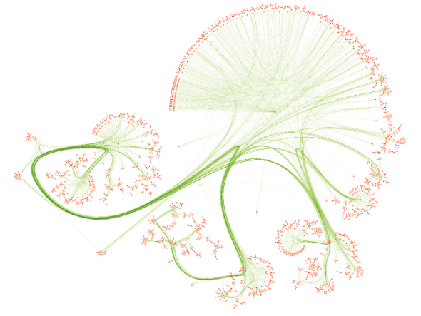

## 🪸 Cora Dataset
Cora is a scientific paper citation network of 2708 publications, where each node is a paper and each connection is a reference. Each publication is descried as a binary vector of 1433 unique words (bag of words). The goal is Classify the category of scientific paper citation network by building different types of neural networks, such as Multilayer Perceptrons (MLP), Vanilla, GNNs, and GCN

<!--  -->

